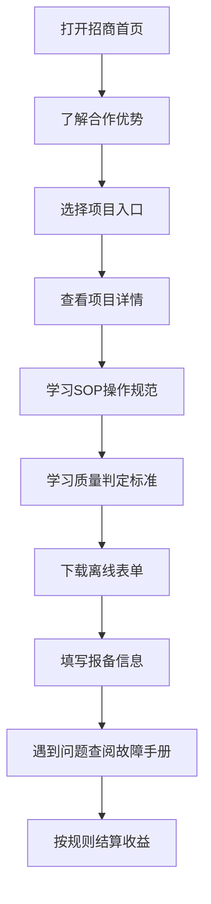

## 1. Product Overview
局域网离线供应商合作培训平台，无需外网，同局域网任意设备可访问，提供一站式全品类采集项目培训、标准化设备教学、质量判定、故障处理及结算流程。
- 目标用户：新工厂/商业/农业采集供应商，核心诉求：低成本上手、清晰收益、标准化作业、故障快速解决、流程透明
- 核心价值：离线培训无需网络、全套设备免费提供、多场景接单机会、结算透明有保障

## 2. Core Features

### 2.1 User Roles
| Role | Registration Method | Core Permissions |
|------|---------------------|------------------|
| 供应商 | 无需注册 | 浏览所有培训内容、下载表单、查看SOP文档 |
| 管理员 | 本地文件管理 | 更新内容、维护页面 |

### 2.2 Feature Module
1. **合作招商首页**：核心优势展示、四大项目入口、合作流程、联系方式
2. **四大项目专区**：AT头戴/DF iPhone/BTS流水线/SW头戴设备独立培训专区
3. **标准化SOP库**：全设备运维操作文档，支持搜索、分页、打印
4. **质量判定中心**：废片标准、实拍案例对比展示
5. **异常故障处理手册**：按设备分类的故障速查指南
6. **离线表单工具区**：可本地填写的各类报备模板
7. **物流邮寄&结算说明**：邮寄信息、结算规则、对接人分工

### 2.3 Page Details
| Page Name | Module Name | Feature description |
|-----------|-------------|---------------------|
| 合作招商首页 | Hero区域 | 大标题展示平台定位，吸引供应商注意 |
| 合作招商首页 | 核心优势 | 大字醒目展示免费设备、多场景接单、结算透明等利好 |
| 合作招商首页 | 项目入口 | 四大项目快速入口按钮（AT/DF/BTS/SW） |
| 合作招商首页 | 合作流程 | 极简流程图：对接→设备申领→培训采集→数据上传→对账结算 |
| 合作招商首页 | 联系信息 | 对接负责人、咨询渠道、邮寄地址公示 |
| 四大项目专区 | AT头戴采集 | 设备清单、开工准备、操作流程、巡检、午休调整、完工数据处理 |
| 四大项目专区 | DF iPhone采集 | EDL软件参数、角度规范、拍摄禁令、自检表、废片分级判定、实拍案例 |
| 四大项目专区 | BTS流水线 | 链路式完整工序、20-30min分段采集规则、WiFi要求、工序申报流程 |
| 四大项目专区 | SW头戴设备 | 设备灯光电量识别、网页配对操作、按键保存、电脑导出上传、工序申报限制 |
| SOP运维资料库 | 文档列表 | 整合4份文档全部操作规范，可搜索、分页查看 |
| SOP运维资料库 | 文档详情 | 支持本地打印导出 |
| 质量判定中心 | 判定原则 | 采集核心三原则：看得清、拍得稳、动作有效 |
| 质量判定中心 | 废片分级 | Tier1直接作废/Tier2风险对照表，分操作/设备/环境三类问题 |
| 质量判定中心 | 案例展示 | 左右分栏「合格画面VS不合格画面」，配文字说明整改方法 |
| 异常故障处理手册 | AT设备故障 | 断电、停机、上传失败、内存不足处理方案 |
| 异常故障处理手册 | DF手机故障 | 各类手机端故障处理方案 |
| 异常故障处理手册 | SW头戴故障 | 设备连接、保存、导出故障处理方案 |
| 离线表单工具区 | 报备模板 | 每日报备模板、设备签收单、作业记录表、工序申报模板 |
| 离线表单工具区 | 表单填写 | 本地离线可填写，填写完成本地保存 |
| 物流结算专区 | 邮寄信息 | 设备收发统一邮寄地址、联系人、电话 |
| 物流结算专区 | 结算规则 | 完整报备、无遗漏记录、异常提前报备不扣款 |
| 物流结算专区 | 对接人分工 | 采集问题@宁飞，结算问题@代思宏 |

## 3. Core Process
供应商浏览首页→了解合作优势→选择感兴趣的项目→查看项目详情和SOP→学习质量判定标准→下载表单填写报备→遇到问题查阅故障手册→按结算规则获取收益

## 4. User Interface Design

### 4.1 Design Style
- **主色调**：绿色系（代表合作利好、安全保障）
- **辅助色**：红色（用于禁令、风险提示）、橙色（用于注意事项）
- **文字色**：深灰色（基础说明）、黑色（重要标题）
- **按钮风格**：圆角矩形，绿色背景白色文字，悬停效果明显
- **字体**：使用系统字体，保证离线环境下正常显示
- **布局风格**：卡片式布局，清晰的信息层级，图文结合
- **图标风格**：简洁线性图标，直观表达功能

### 4.2 Page Design Overview
| Page Name | Module Name | UI Elements |
|-----------|-------------|-------------|
| 合作招商首页 | Hero区域 | 大标题+副标题+背景图，醒目的绿色主题色 |
| 合作招商首页 | 核心优势 | 4个卡片展示，绿色边框，图标+文字说明 |
| 合作招商首页 | 项目入口 | 4个大型按钮，不同颜色区分，悬停放大效果 |
| 合作招商首页 | 合作流程 | 横向流程图，箭头连接，步骤清晰 |
| 四大项目专区 | 项目导航 | 顶部Tab切换，方便浏览不同项目 |
| 四大项目专区 | 内容区域 | 卡片式布局，图文分步说明，关键步骤标绿 |
| 质量判定中心 | 案例展示 | 左右分栏对比，左侧合格右侧不合格，红色标记问题点 |
| 异常故障处理手册 | 故障列表 | 按设备分类，折叠式展开，红色标记风险等级 |
| 离线表单工具区 | 表单列表 | 卡片式展示，下载按钮醒目 |
| 物流结算专区 | 信息展示 | 清晰的表格和联系方式，关键信息标绿突出 |

### 4.3 Responsiveness
- 采用移动端优先设计，适配手机、平板、电脑
- 使用弹性布局，自动适应不同屏幕尺寸
- 触摸友好的按钮尺寸和间距
- 导航菜单在移动端自动折叠为汉堡菜单

### 4.4 3D Scene Guidance
不适用，本项目为纯2D静态网页站点。
