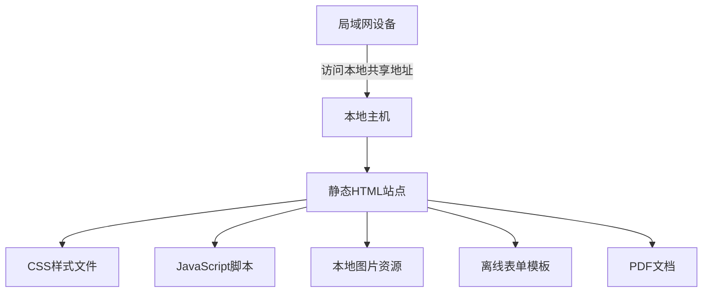

## 1. Architecture Design


## 2. Technology Description
- **Frontend**: React@18 + tailwindcss@3 + vite
- **Initialization Tool**: vite-init
- **Backend**: None (纯静态离线站点)
- **Database**: None (无数据库需求)
- **Storage**: 本地文件系统存储所有资源

## 3. Route Definitions
| Route | Purpose |
|-------|---------|
| / | 合作招商首页 |
| /projects/at | AT头戴采集专区 |
| /projects/df | DF iPhone采集专区 |
| /projects/bts | BTS流水线专项专区 |
| /projects/sw | SW头戴设备专区 |
| /sop | SOP运维资料库 |
| /quality | 质量判定中心 |
| /troubleshooting | 异常故障处理手册 |
| /forms | 离线表单工具区 |
| /logistics | 物流邮寄&结算说明 |

## 4. API Definitions
不适用，本项目为纯静态离线站点，无需API调用。

## 5. Server Architecture Diagram
不适用，本项目无需后端服务器。

## 6. Data Model
不适用，本项目为纯静态内容展示，无需数据库。

## 7. Project Structure
```
离线供应商平台根目录/
├── index.html
├── package.json
├── vite.config.ts
├── tailwind.config.js
├── postcss.config.js
├── tsconfig.json
├── src/
│   ├── main.tsx
│   ├── App.tsx
│   ├── index.css
│   ├── components/
│   │   ├── Header.tsx
│   │   ├── Footer.tsx
│   │   ├── Navigation.tsx
│   │   ├── Card.tsx
│   │   ├── Button.tsx
│   │   └── ...
│   ├── pages/
│   │   ├── Home.tsx
│   │   ├── Projects/
│   │   │   ├── ATProject.tsx
│   │   │   ├── DFProject.tsx
│   │   │   ├── BTSProject.tsx
│   │   │   └── SWProject.tsx
│   │   ├── SOPLibrary.tsx
│   │   ├── QualityCenter.tsx
│   │   ├── Troubleshooting.tsx
│   │   ├── Forms.tsx
│   │   └── Logistics.tsx
│   ├── data/
│   │   └── content.ts (所有页面内容数据)
│   └── assets/
│       ├── images/
│       │   └── ... (实拍案例图片)
│       └── docs/
│           └── ... (PDF文档)
└── public/
    └── ... (静态资源)
```

## 8. Offline Deployment Requirements
1. 所有资源使用本地相对路径引用
2. 无任何外网API调用
3. 无在线字体引入，使用系统字体
4. 无CDN依赖，所有资源打包到本地
5. 支持直接打开HTML文件浏览（file://协议）
6. 支持局域网共享访问

## 9. Build Configuration
- 使用vite构建工具
- 构建输出目录为dist/
- 构建产物包含所有HTML、CSS、JS、图片资源
- 无需后端部署，直接将dist目录放置在本地主机或U盘即可
